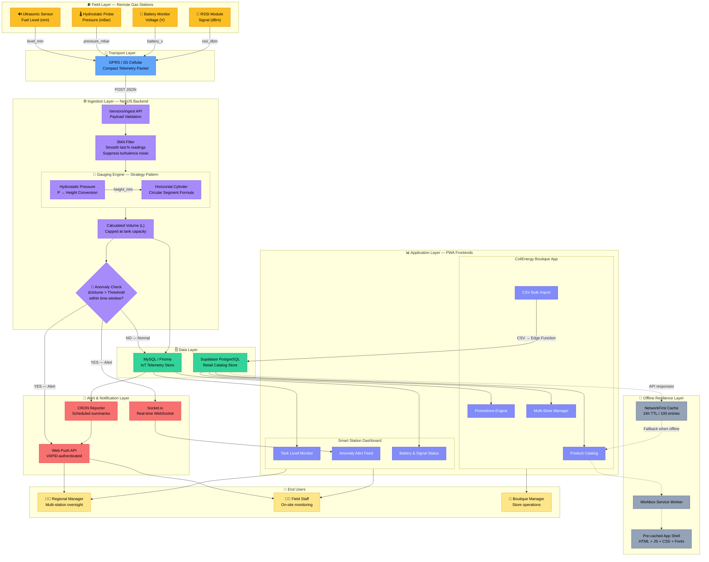
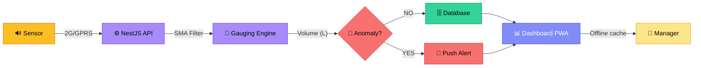
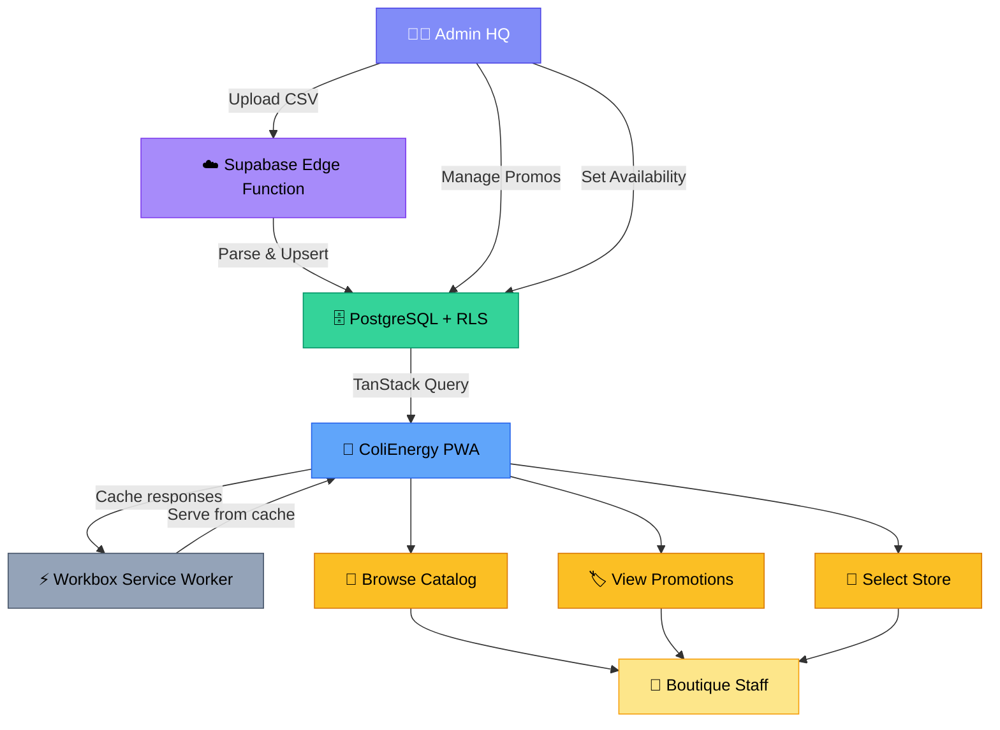

# Mali Promo — Architecture Flowchart

## End-to-End Data Flow: Sensor → Cloud → Dashboard

```mermaid
flowchart TB
    subgraph FIELD["⛽ Field Layer — Remote Gas Stations"]
        direction LR
        US["🔊 Ultrasonic Sensor\nFuel Level (mm)"]
        HP["🌡️ Hydrostatic Probe\nPressure (mBar)"]
        BAT["🔋 Battery Monitor\nVoltage (V)"]
        RSSI["📶 RSSI Module\nSignal (dBm)"]
    end

    subgraph TRANSPORT["📡 Transport Layer"]
        GPRS["GPRS / 2G Cellular\nCompact Telemetry Packet"]
    end

    subgraph INGESTION["⚙️ Ingestion Layer — NestJS Backend"]
        direction TB
        ENDPOINT["/sensors/ingest API\nPayload Validation"]
        SMA["SMA Filter\nSmooth last N readings\nSuppress turbulence noise"]
        
        subgraph GAUGING["📐 Gauging Engine — Strategy Pattern"]
            direction LR
            HCS["Horizontal Cylinder\nCircular Segment Formula"]
            HPS["Hydrostatic Pressure\nP → Height Conversion"]
        end
        
        VOLUME["Calculated Volume (L)\nCapped at tank capacity"]
        ANOMALY{"🚨 Anomaly Check\nΔVolume > Threshold\nwithin time window?"}
    end

    subgraph ALERTS["🔔 Alert & Notification Layer"]
        direction LR
        WS["Socket.io\nReal-time WebSocket"]
        PUSH["Web Push API\nVAPID-authenticated"]
        CRON["CRON Reporter\nScheduled summaries"]
    end

    subgraph DATA["🗄️ Data Layer"]
        direction LR
        MYSQL["MySQL / Prisma\nIoT Telemetry Store"]
        SUPA["Supabase PostgreSQL\nRetail Catalog Store"]
    end

    subgraph DASHBOARD["📊 Application Layer — PWA Frontends"]
        direction LR
        
        subgraph IOT_DASH["Smart Station Dashboard"]
            TANKS["Tank Level Monitor"]
            ALERT_FEED["Anomaly Alert Feed"]
            BATTERY["Battery & Signal Status"]
        end
        
        subgraph BOUTIQUE["ColiEnergy Boutique App"]
            CATALOG["Product Catalog"]
            PROMOS["Promotions Engine"]
            STORES["Multi-Store Manager"]
            IMPORT["CSV Bulk Import"]
        end
    end

    subgraph OFFLINE["📴 Offline Resilience Layer"]
        SW["Workbox Service Worker"]
        CACHE["NetworkFirst Cache\n24h TTL / 100 entries"]
        SHELL["Pre-cached App Shell\nHTML + JS + CSS + Fonts"]
    end

    subgraph USERS["👤 End Users"]
        direction LR
        MANAGER["🧑‍💼 Regional Manager\nMulti-station oversight"]
        STAFF["🧑‍🔧 Field Staff\nOn-site monitoring"]
        BOUTIQUE_MGR["🛒 Boutique Manager\nStore operations"]
    end

    %% Data Flow: Sensor → Ingestion
    US -->|"level_mm"| GPRS
    HP -->|"pressure_mbar"| GPRS
    BAT -->|"battery_v"| GPRS
    RSSI -->|"rssi_dbm"| GPRS
    GPRS -->|"POST JSON"| ENDPOINT

    %% Ingestion Pipeline
    ENDPOINT --> SMA
    SMA --> GAUGING
    HPS -->|"height_mm"| HCS
    GAUGING --> VOLUME
    VOLUME --> ANOMALY

    %% Anomaly branching
    ANOMALY -->|"YES — Alert"| WS
    ANOMALY -->|"YES — Alert"| PUSH
    ANOMALY -->|"NO — Normal"| MYSQL

    %% Normal data storage
    VOLUME --> MYSQL

    %% CRON scheduled reporting
    MYSQL --> CRON
    CRON --> PUSH

    %% Dashboard consumption
    WS --> ALERT_FEED
    MYSQL --> TANKS
    MYSQL --> BATTERY

    %% Boutique data flow
    SUPA --> CATALOG
    SUPA --> PROMOS
    SUPA --> STORES
    IMPORT -->|"CSV → Edge Function"| SUPA

    %% Offline layer
    SUPA -.->|"API responses"| CACHE
    CATALOG -.-> SW
    SW -.-> SHELL
    CACHE -.->|"Fallback when offline"| CATALOG

    %% Users
    IOT_DASH --> MANAGER
    IOT_DASH --> STAFF
    PUSH --> MANAGER
    PUSH --> STAFF
    BOUTIQUE --> BOUTIQUE_MGR

    %% Styling
    classDef sensor fill:#fbbf24,stroke:#d97706,color:#000
    classDef transport fill:#60a5fa,stroke:#2563eb,color:#000
    classDef backend fill:#a78bfa,stroke:#7c3aed,color:#000
    classDef alert fill:#f87171,stroke:#dc2626,color:#000
    classDef data fill:#34d399,stroke:#059669,color:#000
    classDef dashboard fill:#818cf8,stroke:#4f46e5,color:#fff
    classDef offline fill:#94a3b8,stroke:#475569,color:#000
    classDef user fill:#fde68a,stroke:#f59e0b,color:#000

    class US,HP,BAT,RSSI sensor
    class GPRS transport
    class ENDPOINT,SMA,HCS,HPS,VOLUME,ANOMALY backend
    class WS,PUSH,CRON alert
    class MYSQL,SUPA data
    class TANKS,ALERT_FEED,BATTERY,CATALOG,PROMOS,STORES,IMPORT dashboard
    class SW,CACHE,SHELL offline
    class MANAGER,STAFF,BOUTIQUE_MGR user
```

## Simplified Linear Flow

```mermaid
flowchart LR
    A["🔊 Sensor"] -->|"2G/GPRS"| B["⚙️ NestJS API"]
    B -->|"SMA Filter"| C["📐 Gauging Engine"]
    C -->|"Volume (L)"| D{"🚨 Anomaly?"}
    D -->|"YES"| E["🔔 Push Alert"]
    D -->|"NO"| F["🗄️ Database"]
    F --> G["📊 Dashboard PWA"]
    E --> G
    G -->|"Offline cache"| H["👤 Manager"]

    style A fill:#fbbf24,stroke:#d97706,color:#000
    style B fill:#a78bfa,stroke:#7c3aed,color:#000
    style C fill:#a78bfa,stroke:#7c3aed,color:#000
    style D fill:#f87171,stroke:#dc2626,color:#000
    style E fill:#f87171,stroke:#dc2626,color:#000
    style F fill:#34d399,stroke:#059669,color:#000
    style G fill:#818cf8,stroke:#4f46e5,color:#fff
    style H fill:#fde68a,stroke:#f59e0b,color:#000
```

## Retail Data Flow (Boutique App)

```mermaid
flowchart TB
    ADMIN["🧑‍💼 Admin HQ"] -->|"Upload CSV"| EDGE["☁️ Supabase Edge Function"]
    EDGE -->|"Parse & Upsert"| DB["🗄️ PostgreSQL + RLS"]
    ADMIN -->|"Manage Promos"| DB
    ADMIN -->|"Set Availability"| DB

    DB -->|"TanStack Query"| PWA["📱 ColiEnergy PWA"]
    PWA -->|"Cache responses"| WB["⚡ Workbox Service Worker"]
    WB -->|"Serve from cache"| PWA

    PWA --> BROWSE["🛒 Browse Catalog"]
    PWA --> PROMO["🏷️ View Promotions"]
    PWA --> STORE["📍 Select Store"]

    BROWSE --> CUSTOMER["👤 Boutique Staff"]
    PROMO --> CUSTOMER
    STORE --> CUSTOMER

    style ADMIN fill:#818cf8,stroke:#4f46e5,color:#fff
    style EDGE fill:#a78bfa,stroke:#7c3aed,color:#000
    style DB fill:#34d399,stroke:#059669,color:#000
    style PWA fill:#60a5fa,stroke:#2563eb,color:#000
    style WB fill:#94a3b8,stroke:#475569,color:#000
    style BROWSE fill:#fbbf24,stroke:#d97706,color:#000
    style PROMO fill:#fbbf24,stroke:#d97706,color:#000
    style STORE fill:#fbbf24,stroke:#d97706,color:#000
    style CUSTOMER fill:#fde68a,stroke:#f59e0b,color:#000
```
